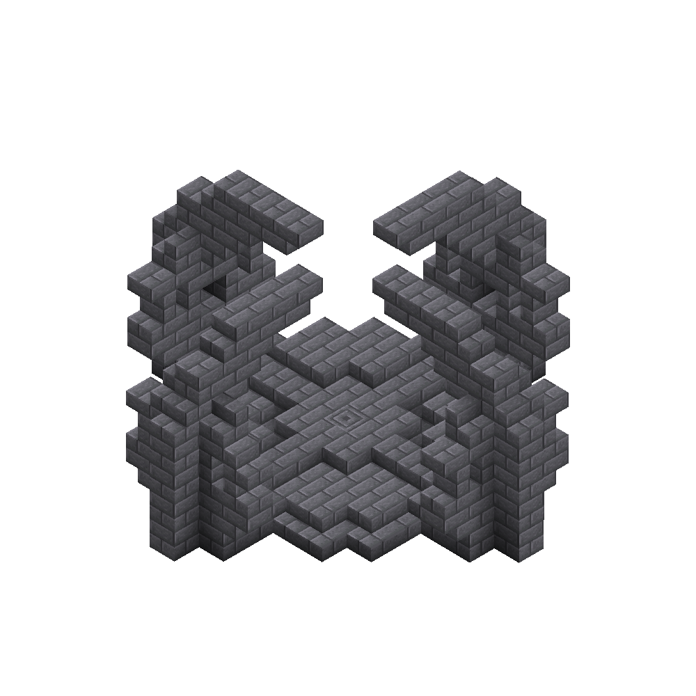
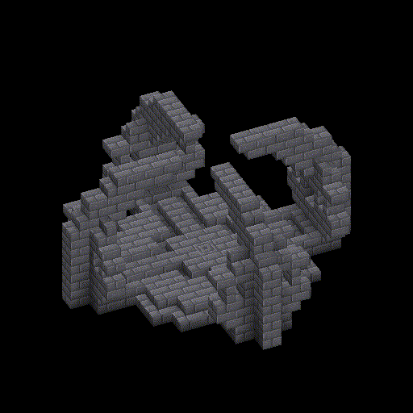

# Songs of Power

This mod add song abilities from Songs of War Animation.

**Note: This mod is still under construction!**

## Usage

### Admin command (Or single player)

`/songpower enable/disable <player>` to enable/disable access to song abilities.

### Combine song cube

#### For 0.4+

Build a shrine structure below. Put song cube in the hole like how to do in Animation.
Then stand on the `chiseled stone bricks`, look at the song cube and sneak for 3s.

If everything is correct, the song cube will start spawning particles. After an explosion, the combination is completed.

**Note: 1.The stone bricks and stairs can be any kinds. (mossy/cracked ones, can change through datapack.)**

**2.If you already have one in that category, the previous one will be replaced into the hole.**

#### For 0.4-

`/songpower use/replace` learn ability from song stone in your hand.

## Currently Added abilities

### Aggressium

**HotKey: C**

- Aggrosphere: Fire a sphere and damage hit entity or create explosion.
- Aggroquake: Push entities around you away and damage them.
- Aggroshock **(Experimental)**: Generate lightnings.

### Mobilium

**HotKey: V**

- Mobiliflash: Teleport to the direction you see, has a delay of 10 ticks.
- Mobiliwings: Enable a fake elytra and into sliding mode.
- Mobiliglide: Slow falling.

### Protisium

**HotKey: B**

- Protesphere **(Recommend AttributeFix)**: Enable a protect shield and reduce 80% damage.
- Protepoint: Enable a fake shield.
- Proteheal: Heal 10 times with 1 health each.

### Supportium

**HotKey: N**

- Supporolift: Pull a entity you are looking at in 20 blocks.

## My other works

- **Songs of War**: SoW Main
  Mod [Curseforge](https://www.curseforge.com/minecraft/mc-mods/songs-of-war) | [Modrinth](https://modrinth.com/mod/songs-of-war)
- **Songs of Origins**: SoW x
  Origins [Curseforge](https://www.curseforge.com/minecraft/mc-mods/songs-of-origins) | [Modrinth](https://modrinth.com/mod/songs-of-origins)
- *Songs of Power*: Song
  abilities [Curseforge](https://www.curseforge.com/minecraft/mc-mods/songs-of-power) | [Modrinth](https://modrinth.com/mod/songs-of-power)
- **Songs of War RPG**: SoW RPG
  Modpack [Curseforge](https://www.curseforge.com/minecraft/modpacks/songs-of-war-rpg) | [Modrinth](https://modrinth.com/modpack/songs-of-war-rpg)
